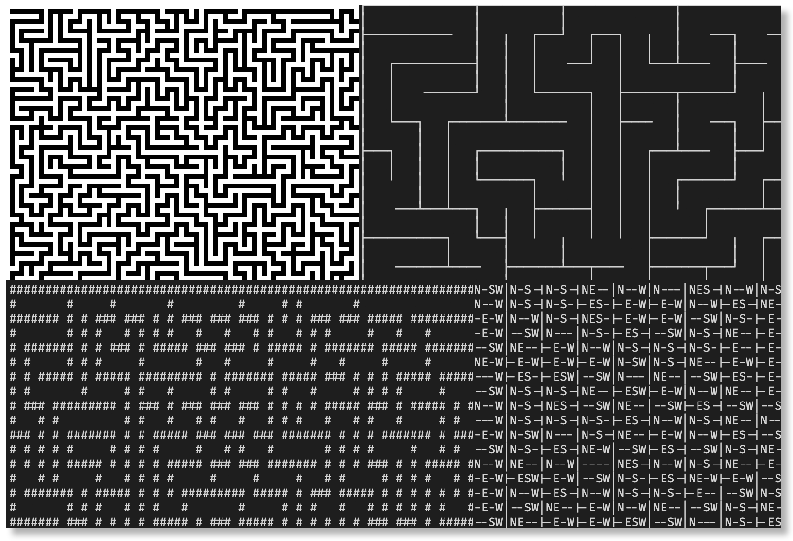
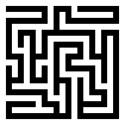

# Maze Generator

A C++ maze generator using recursive backtracking.

Instead of using a recursive function to calculate the maze it is using its own data stack to store
backtracking information which means the mazes can be arbitrarily big and are not limited by the size of the
call stack.

It supports four different output formats:

- **Text**: Uses ASCII `#` characters for walls.
- **Pretty**: Uses UNICODE line drawing characters.
- **Data**: Export the internal wall data.
- **Raw**: Generate a raw 1 byte per pixel grayscale image.

## Dependencies

- CMake
- Vcpkg

## Build

Example build instructions for CMake and Vcpkg. These examples assume that Vcpkg is installed in your home directory.
Adjust the paths if necessary.

This will build three binaries: The main binary, tests and benchmarks.

#### Vcpkg toolchain

Pass the Vcpkg toolchain file via `CMAKE_TOOLCHAIN_FILE`.

- Windows: `-DCMAKE_TOOLCHAIN_FILE=%HOMEPATH%\vcpkg\scripts\buildsystems\vcpkg.cmake`
- Unix systems: `-DCMAKE_TOOLCHAIN_FILE=$HOME/vcpkg/scripts/buildsystems/vcpkg.cmake`

### Linux & Mac

```
$ mkdir build
$ cmake -G Ninja -DCMAKE_BUILD_TYPE=Release -DCMAKE_TOOLCHAIN_FILE=$HOME/vcpkg/scripts/buildsystems/vcpkg.cmake -B build
$ cmake --build build
```

```
$ ls -l build/src/*/{maze_generator,maze_generator_tests,maze_generator_benchmark}

-rwxr-xr-x 1 toxe toxe 525K Oct  1 12:35 build/src/benchmark/maze_generator_benchmark*
-rwxr-xr-x 1 toxe toxe 900K Oct  1 12:35 build/src/maze_generator/maze_generator*
-rwxr-xr-x 1 toxe toxe 2.0M Oct  1 12:35 build/src/tests/maze_generator_tests*
```

### Windows

```
PS> mkdir build
PS> cmake -DCMAKE_BUILD_TYPE=Release -DCMAKE_TOOLCHAIN_FILE="$HOME\vcpkg\scripts\buildsystems\vcpkg.cmake" -B build
PS> cmake --build build --config Release
```

```
PS> dir .\build\src\*\Release\*.exe | Select-Object -Property Length,Directory,Name

Length Directory                                                                        Name
------ ---------                                                                        ----
239104 C:\Users\toxe\Programmierung\C++\maze-generator\build\src\benchmark\Release      maze_generator_benchmark.exe
317440 C:\Users\toxe\Programmierung\C++\maze-generator\build\src\maze_generator\Release maze_generator.exe
783872 C:\Users\toxe\Programmierung\C++\maze-generator\build\src\tests\Release          maze_generator_tests.exe
```

## Usage

```
$ maze_generator --help
Maze Generator
Usage: maze_generator [OPTIONS] [width] [height] [filename]

Positionals:
  width INT                   maze width (default: 10)
  height INT                  maze height (default: 10)
  filename TEXT               output filename

Options:
  -h,--help                   Print this help message and exit
  -s,--seed INT               random seed (0 or bigger)
  -z,--zoom INT               pixel zoom factor for .raw files (default: 1)
  -i,--info                   output additional info (default: false)
  -v [0]                      log level (-v: INFO, -vv: DEBUG, -vvv: TRACE)
[Option Group: output format (default: text)]
  Options:
    -t,--text Excludes: --pretty --data --raw
                                text: uses ASCII '#' characters for walls
    -p,--pretty Excludes: --text --data --raw
                                pretty: uses UNICODE line drawing characters
    -d,--data Excludes: --text --pretty --raw
                                data: export the internal wall data
    -r,--raw Excludes: --text --pretty --data
                                raw: generate a 1 byte per pixel grayscale raw image
```

# Examples

## Default

Output 10×10 maze with random seed in text format (and show info).

```
maze_generator --info
```

```
width: 10
height: 10
seed: 693865641
#####################
#     #       #     #
##### ### ##### # ###
#   #   # #   # #   #
# ##### # # # # ### #
#     # #   #   #   #
# ### # ######### ###
#   #   #       #   #
### ##### ##### # # #
# # #     #   # # # #
# # # ### # # # ### #
#   #   # # # #     #
# ### ### # # ##### #
# # # #   # #     # #
# # # # ### ### ### #
# #   #   #   #   # #
# ##### # ### ### # #
#     # # # #   #   #
##### ### # ### #####
#         #         #
#####################
```

## "Text" format

Generate 10×10 `text` format maze with random seed 42 and save it in file `example.txt`.

```
maze_generator --seed 42 --text 10 10 example.txt
```

```
#####################
#       #   #       #
####### # # ####### #
#       # #         #
# ####### ###########
# #   #         #   #
# # # # ####### # # #
# # # # #     # # # #
# ### # # ### # # # #
#   #   # #   #   # #
### # ### # ##### # #
# # # # # #     # # #
# # # # # ##### # # #
#   #   #   # # # # #
# ####### # # # ### #
#       # # # #   # #
####### ### # ### # #
#     #   # #     # #
# ####### # # ##### #
#           #       #
#####################
```

## "Pretty" format (UNICODE line drawing characters)

Generate 10×10 `pretty` format maze with random seed 42 and save it in file `example.pretty`.

```
maze_generator --seed 42 --pretty 10 10 example.pretty
```

```
┌───────────────┬───────┬───────────────┐
│               │       │               │
├────────────   │   ╷   └────────────   │
│               │   │                   │
│   ┌───────┬───┘   └───────────┬───────┤
│   │       │                   │       │
│   │   ╷   │   ┌───────────┐   │   ╷   │
│   │   │   │   │           │   │   │   │
│   └───┤   ╵   │   ┌────   │   ╵   │   │
│       │       │   │       │       │   │
├───┐   │   ┌───┤   │    ───┴───┐   │   │
│   │   │   │   │   │           │   │   │
│   ╵   │   ╵   │   └───┬───┐   │   │   │
│       │       │       │   │   │   │   │
│    ───┴───────┤   ╷   │   │   └───┤   │
│               │   │   │   │       │   │
├───────────┐   └───┤   │   └────   │   │
│           │       │   │           │   │
│    ───────┴────   ╵   │    ───────┘   │
│                       │               │
└───────────────────────┴───────────────┘
```

## "Raw" image format

Generate 10×10 `raw` format maze with random seed 42 and save it in file `example.raw`.

### Without zoom

Without zoom this generates a raw 1 byte per pixel grayscale image.

The image dimensions are:

- image width: maze width × 2 + 1
- image height: maze height × 2 + 1

Example: Image size of a 10×10 maze is 21×21 pixels.

```
maze_generator --seed 42 --raw 10 10 example.raw
```


#### Convert raw image to PNG

##### ImageMagick

```
convert -size 21x21 -depth 8 gray:example.raw example.png
```

##### IrfanView

- Image width and height: 21
- 8 BPP grayscale

### With zoom

With zoom enabled this generates a raw "zoom-level" bytes-per-pixel grayscale image.

The image dimensions are:

- image width: zoom level × (maze width × 2 + 1)
- image height: zoom level × (maze height × 2 + 1)

Example: Image size of a 10×10 maze with zoom level 10 is 210×210 pixels.

```
maze_generator --seed 42 --raw --zoom 10 10 10 example10.raw
```



#### Convert raw image to PNG

##### ImageMagick

```
convert -size 210x210 -depth 8 gray:example10.raw example10.png
```

##### IrfanView

- Image width and height: 210
- 8 BPP grayscale

## "Data" format (dump internal data structure)

Generate 10×10 `data` format maze with random seed 42 and save it in file `example.data`.

```
maze_generator --seed 42 --data 10 10 example.data
```

```
N-SW|N-S-|N-S-|NE--|N--W|NE--|N-SW|N-S-|N-S-|NE--
N--W|N-S-|N-S-|-ES-|-E-W|--SW|N-S-|N-S-|N-S-|-ES-
-E-W|N--W|NE--|N--W|--S-|N-S-|N-S-|NE--|N--W|NE--
-E-W|-ESW|-E-W|-E-W|N--W|N-S-|NE--|-E-W|-E-W|-E-W
--SW|NE--|---W|-ES-|-E-W|N--W|-ES-|--SW|-E--|-E-W
NE-W|-E-W|-E-W|NE-W|-E-W|--SW|N-S-|NE--|-E-W|-E-W
---W|-ES-|--SW|-ES-|---W|NE--|NE-W|-E-W|-ESW|-E-W
--SW|N-S-|N-S-|NE--|-ESW|-E-W|-E-W|--SW|NE--|-E-W
N--W|N-S-|NES-|--SW|NE--|-E-W|---W|N-S-|-ES-|-E-W
--SW|N-S-|N-S-|N-S-|--S-|-ES-|--SW|N-S-|N-S-|-ES-
```

## Tests

```
$ ./build/src/tests/maze_generator_tests
```

```
===============================================================================
All tests passed (140 assertions in 5 test cases)
```

## Benchmarks

```
$ ./build/src/benchmark/maze_generator_benchmark
```

```
2022-10-01T11:15:27+02:00
Running ./build/src/benchmark/maze_generator_benchmark
Run on (24 X 4000 MHz CPU s)
CPU Caches:
  L1 Data 32 KiB (x12)
  L1 Instruction 32 KiB (x12)
  L2 Unified 512 KiB (x12)
  L3 Unified 16384 KiB (x4)
---------------------------------------------------------------------
Benchmark                           Time             CPU   Iterations
---------------------------------------------------------------------
BM_generate/1                    2562 ns         2567 ns       280000
BM_generate/4                    3371 ns         3369 ns       213333
BM_generate/16                  10181 ns        10010 ns        64000
BM_generate/64                 175431 ns       171611 ns         3733
BM_generate/256               2901936 ns      2913136 ns          236
BM_generate/1024             43803913 ns     43945312 ns           16
BM_output/text/1                  349 ns          353 ns      2036364
BM_output/text/4                 2435 ns         2459 ns       298667
BM_output/text/16               30261 ns        30483 ns        23579
BM_output/text/64              444755 ns       444984 ns         1545
BM_output/text/256            6979298 ns      6975446 ns          112
BM_output/text/1024         111385550 ns    111979167 ns            6
BM_output/pretty/1                909 ns          921 ns       746667
BM_output/pretty/4               5605 ns         5580 ns       112000
BM_output/pretty/16             66586 ns        66267 ns         8960
BM_output/pretty/64            994260 ns      1004016 ns          747
BM_output/pretty/256         15833876 ns     15972222 ns           45
BM_output/pretty/1024       250759500 ns    250000000 ns            3
BM_output/data/1                  183 ns          181 ns      3446154
BM_output/data/4                 3134 ns         3139 ns       224000
BM_output/data/16               50482 ns        50223 ns        11200
BM_output/data/64              805500 ns       819615 ns          896
BM_output/data/256           12270432 ns     12276786 ns           56
BM_output/data/1024         205647633 ns    208333333 ns            3
BM_output/raw_zoom_1/1            334 ns          337 ns      2133333
BM_output/raw_zoom_1/4           3147 ns         3139 ns       224000
BM_output/raw_zoom_1/16         42062 ns        42969 ns        16000
BM_output/raw_zoom_1/64        632386 ns       641741 ns         1120
BM_output/raw_zoom_1/256     10011679 ns     10000000 ns           75
BM_output/raw_zoom_1/1024   158342375 ns    160156250 ns            4
BM_output/raw_zoom_10/1         27594 ns        27867 ns        26353
BM_output/raw_zoom_10/4        272927 ns       272770 ns         2635
BM_output/raw_zoom_10/16      3715943 ns      3676471 ns          187
BM_output/raw_zoom_10/64     57058827 ns     56818182 ns           11
BM_output/raw_zoom_10/256   906239900 ns    906250000 ns            1
BM_output/raw_zoom_10/1024 14755845700 ns   14750000000 ns            1
```
