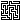

# Maze Generator
A C++ maze generator that uses recursive backtracking.

The generator is not using a recursive function to calculate the maze but is using its own data stack to store backtracking information which in return means the mazes can be arbitrarily big and are not limited by the size of the call stack.

It supports four different output formats:

- **Text**: Uses ASCII `#` characters for walls.
- **Pretty**: Uses UNICODE line drawing characters.
- **Data**: Export the internal wall data.
- **Raw**: Generate a 1 byte per pixel grayscale raw image.

## Dependencies

- CMake
- Clipp

### Vcpkg

Install Vcpkg dependencies with:

    $ vcpkg install $(< .vcpkg)

## Usage
```
$ ./maze_generator
SYNOPSIS
        maze_generator [-t|-p|-d|-r] [-s <seed>] [-z <zoom>] [-i] <width> <height> [<filename>]

OPTIONS
        -t, --text|-p, --pretty|-d, --data|-r, --raw
                    output format (default: text)

        -s, --seed <seed>
                    random seed (0 or bigger)

        -z, --zoom <zoom>
                    pixel zoom factor for .raw files (default: 1)

        -i, --info  output additional info
        <width>     maze width
        <height>    maze height
        <filename>  output filename

EXAMPLE
        maze_generator 20 20 test.maze
```

# Examples

Generate 10x10 mazes with random seed 42.

## Default "text" format

```
maze_generator --seed 42 --text 10 10 example.txt
```

```
#####################
#       #   #       #
####### # # ####### #
#       # #         #
# ####### ###########
# #   #         #   #
# # # # ####### # # #
# # # # #     # # # #
# ### # # ### # # # #
#   #   # #   #   # #
### # ### # ##### # #
# # # # # #     # # #
# # # # # ##### # # #
#   #   #   # # # # #
# ####### # # # ### #
#       # # # #   # #
####### ### # ### # #
#     #   # #     # #
# ####### # # ##### #
#           #       #
#####################
```

## "Pretty" format (UNICODE line drawing characters)

```
maze_generator --seed 42 --pretty 10 10 example.pretty
```

```
┌───────────────┬───────┬───────────────┐
│               │       │               │
├────────────   │   ╷   └────────────   │
│               │   │                   │
│   ┌───────┬───┘   └───────────┬───────┤
│   │       │                   │       │
│   │   ╷   │   ┌───────────┐   │   ╷   │
│   │   │   │   │           │   │   │   │
│   └───┤   ╵   │   ┌────   │   ╵   │   │
│       │       │   │       │       │   │
├───┐   │   ┌───┤   │    ───┴───┐   │   │
│   │   │   │   │   │           │   │   │
│   ╵   │   ╵   │   └───┬───┐   │   │   │
│       │       │       │   │   │   │   │
│    ───┴───────┤   ╷   │   │   └───┤   │
│               │   │   │   │       │   │
├───────────┐   └───┤   │   └────   │   │
│           │       │   │           │   │
│    ───────┴────   ╵   │    ───────┘   │
│                       │               │
└───────────────────────┴───────────────┘
```

## "Data" format (dump internal data structure)

```
maze_generator --seed 42 --data 10 10 example.data
```

```
N-SW|N-S-|N-S-|NE--|N--W|NE--|N-SW|N-S-|N-S-|NE--
N--W|N-S-|N-S-|-ES-|-E-W|--SW|N-S-|N-S-|N-S-|-ES-
-E-W|N--W|NE--|N--W|--S-|N-S-|N-S-|NE--|N--W|NE--
-E-W|-ESW|-E-W|-E-W|N--W|N-S-|NE--|-E-W|-E-W|-E-W
--SW|NE--|---W|-ES-|-E-W|N--W|-ES-|--SW|-E--|-E-W
NE-W|-E-W|-E-W|NE-W|-E-W|--SW|N-S-|NE--|-E-W|-E-W
---W|-ES-|--SW|-ES-|---W|NE--|NE-W|-E-W|-ESW|-E-W
--SW|N-S-|N-S-|NE--|-ESW|-E-W|-E-W|--SW|NE--|-E-W
N--W|N-S-|NES-|--SW|NE--|-E-W|---W|N-S-|-ES-|-E-W
--SW|N-S-|N-S-|N-S-|--S-|-ES-|--SW|N-S-|N-S-|-ES-
```

## "Raw" image format

### Without zoom

Without zoom this generates a 1 byte per pixel grayscale raw image.

The image dimensions are:

- image width = maze width x 2 + 1
- image height = maze height x 2 + 1

Example: Image size of a 10x10 maze is 21x21 pixels.

```
maze_generator --seed 42 --raw 10 10 example.raw
```




### With zoom

With zoom enabled this generates a "zoom level" bytes per pixel grayscale raw image.

The image dimensions are:

- image width = zoom level x (maze width x 2 + 1)
- image height = zoom level (maze height x 2 + 1)

Example: Image size of a 10x10 maze with zoom level 10 is 210x210 pixels.

```
maze_generator --seed 42 --raw --zoom 10 10 10 example10.raw
```


